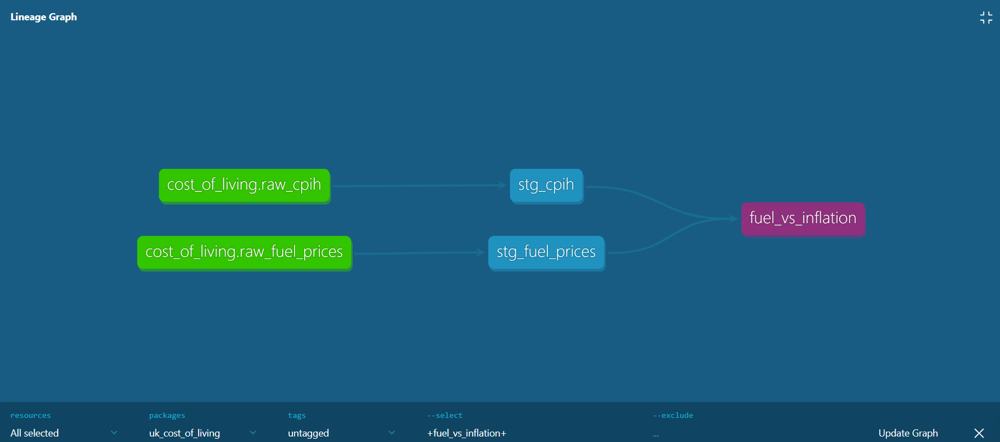
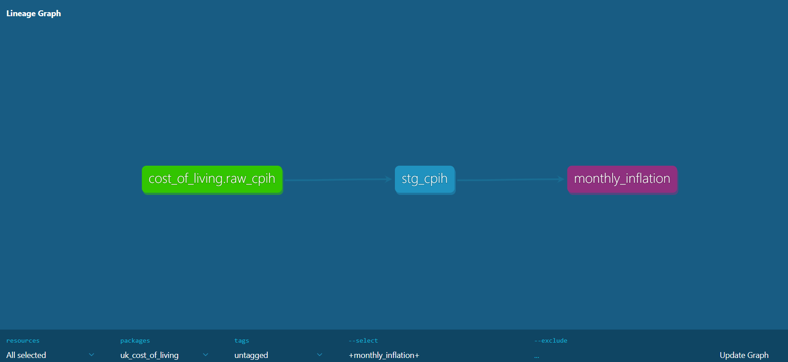

# UK Cost of Living Data Pipeline

An end-to-end data engineering project analysing UK cost of living trends
using real government data, built with Python, dbt, PostgreSQL, and Docker.

---

##  Project Overview

This pipeline ingests, transforms, and models publicly available UK economic
data to explore the relationship between consumer price inflation (CPIH) and
retail fuel prices between 2018 and 2026.

**Questions this project explores:**
- How has overall UK inflation (CPIH) trended over time?
- How do retail fuel prices correlate with broader inflation?
- Are fuel price movements a leading or lagging indicator of CPI changes?

---

## Tech Stack

| Tool            | Purpose                              |
|-----------------|--------------------------------------|
| Python 3.13     | Data ingestion & EDA                 |
| PostgreSQL      | Data warehouse                       |
| dbt             | Data transformation & documentation  |
| Docker Compose  | Local environment (PG + pgAdmin)     |
| Jupyter         | Exploratory data analysis            |
| GitHub Codespaces | Cloud development environment      |

---

## Architecture
Raw CSVs (data/raw/)
│
▼
Python ingestion scripts (src/ingestion/)
│
▼
PostgreSQL — raw tables
(raw_cpih: 55,754 rows | raw_fuel_prices: 434 rows)
│
▼
dbt staging models (views)
(stg_cpih | stg_fuel_prices)
│
▼
dbt mart models (tables)
(monthly_inflation | fuel_vs_inflation)
│
▼
EDA Notebook (notebooks/01_eda.ipynb)

---

##  Project Structure
uk_cost_of_living/
├── data/raw/ ← Source CSVs (ONS + DESNZ)
├── notebooks/
│ └── 01_eda.ipynb ← Exploratory data analysis
├── src/ingestion/
│ ├── utils.py ← DB engine + column name cleaner
│ ├── ingest_cpih.py ← Loads CPIH data → PostgreSQL
│ └── ingest_fuel_prices.py ← Loads fuel price data → PostgreSQL
├── models/
│ ├── staging/
│ │ ├── sources.yml ← dbt source definitions
│ │ ├── schema.yml ← Data quality tests
│ │ ├── stg_cpih.sql ← Cleaned CPIH staging view
│ │ └── stg_fuel_prices.sql ← Cleaned fuel prices staging view
│ └── marts/
│ ├── monthly_inflation.sql ← Monthly CPIH (CP00), 457 rows
│ └── fuel_vs_inflation.sql ← CPIH + fuel joined monthly
├── dbt_project.yml
├── docker-compose.yml
└── requirements.txt


---

## Data Sources

| Dataset | Source | Rows |
|--------|--------|------|
| CPIH Index (all categories) | ONS (Office for National Statistics) | 55,754 |
| Retail Fuel Prices | DESNZ (Dept for Energy Security & Net Zero) | 434 |

---

## dbt Models

### Staging (Views)
- **stg_cpih** — Cleaned column names, parsed dates, all rows retained
- **stg_fuel_prices** — Shortened column names, parsed dates

### Marts (Tables)
- **monthly_inflation** — CP00 (all items) CPIH index, monthly, 2003–2026
- **fuel_vs_inflation** — CPIH headline figure joined with fuel prices
  monthly, 2018–2026

### Data Quality Tests
6 dbt tests configured in `schema.yml` — all passing 
- `not_null` on key columns
- `unique` on primary keys

---

## Running This Project Locally

### Prerequisites
- Docker Desktop
- Python 3.10+
- Git

### 1. Clone the repo
```bash
git clone https://github.com/Mavis0210/uk_cost_of_living.git
cd uk_cost_of_living

### 2. Start PostgreSQL + pgAdmin
        docker compose up -d
    PostgreSQL → localhost:5432
    pgAdmin → http://localhost:8085

### 3. Set up Python environment
        python -m venv .venv
        source .venv/bin/activate       # Windows: .venv\Scripts\activate
        pip install -r requirements.txt

### 4. Ingest raw data
        python src/ingestion/ingest_cpih.py
        python src/ingestion/ingest_fuel_prices.py

### 5. Run dbt transformations
        dbt run
        dbt test

### 6. View documentation & lineage
        dbt docs generate
        dbt docs serve

## Lineage Graph




## Next Steps / Roadmap
 - Visualisations from mart data (matplotlib / Plotly)
 - Automate ingestion with scheduling (Airflow or cron)
 - Add more dbt tests (accepted_values, relationships)
 - Expand to additional ONS datasets (housing, energy bills)

